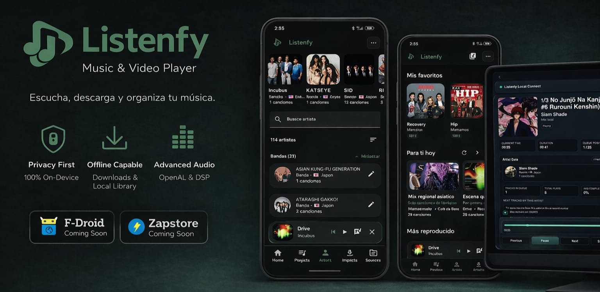

# Listenfy - Offline-First Music & Video Manager

Listenfy is a privacy-first, offline-capable multimedia manager that puts you in total control.
No cloud, no tracking, no algorithms. Just your files, your metadata, your rules.


---

## Key Features 

Listenfy goes far beyond simple playback. It's a complete local media management system.

## Recent User-Facing Improvements

These are the newest quality-of-life additions, focused on making large offline libraries easier to use day to day:

- A dedicated video library experience, with rectangular thumbnails, two-column grids, and list rows that show duration, quality and file size at a glance.
- Video collections now feel closer to a real folder system: you can use nested Collections, switch folders between grid/list views, and add content with a modern searchable picker.
- Collection covers use a wide video-friendly crop, so series, courses and movie folders look natural instead of being forced into square artwork.
- The audio player now includes a Landscape-style view with large artwork, blurred background and the same playback controls users already know.
- Larger Android home-screen media widgets give quick playback control without opening the app.
- Home sections for audio and video keep their own layout choices, so your music setup does not get disturbed when you organize videos.
- Artist country selection is easier to browse, with flags, country names and regional grouping for better Atlas organization.

### Core Playback & Library

- Audio and video playback (gapless, background, lockscreen controls)
- Local library indexing (no external scans needed)
- Playlists, favorites, shuffle, repeat modes
- Moveable audio queue (drag to reorder)

### Atlas - Regional Music Organization

- Tag artists with country/region
- Listenfy groups your music into manual regional "radio stations"
- Perfect for discovering your own collection by geography

### Sources - Video Collections

- Create themed collections (e.g., "Anime", "Tutorials", "Peliculas")
- Nested folders, custom colors and wide covers
- Grid/list switching for video items and Collection folders
- Searchable item picker for adding content to folders
- Ideal for organizing series, courses, or personal videos

### Artist Graph (Relationships)

- Link band members, solo projects, and collaborations
- Automatic detection of ft., feat., & patterns
- Manual editor to fix any relationship

### Advanced Audio Processing (Optional Backend)

- 8D spatial audio - generated via ffmpeg_spatial8d
- Instrumental / vocal extraction - powered by Demucs (state-of-the-art AI)
- Processed files are saved as variants (reusable offline)
- Clean silence removal (>4 seconds, selective trimming)

### Advanced Video Player

- Gestures: double-tap seek, vertical drag for volume (1 finger) / speed (2 fingers)
- Picture-in-Picture (PIP) on Android
- Frame capture (screenshot button)
- Movable video queue
- Orientation adaptive (portrait/landscape)
- Video-focused library layouts with rectangular thumbnails and compact metadata

### Offline P2P Transfers

- Share songs/videos with full metadata via QR code
- No internet required (WiFi Direct / Bluetooth)
- Works between Listenfy devices

### Listenfy Connect

- Turns your device into a local HTTP streaming server
- Open URL or scan QR from any browser on the same WiFi
- Control playback remotely (play, pause, skip, volume)

### Complete Backup & Migration

- Export a single ZIP file containing:
  - All media files (originals + variants like 8D, instrumental)
  - Full database (metadata, playlists, artist relationships)
  - Import history, widgets layout, settings
- Fast compression: ~1.3 GB/minute
- Restore on any device - you get the exact same library

### Import History (with Calendar)

- See every file you added, grouped by day/week/month
- Calendar view with range selector (up to 2.5 months)
- Filter by audio/video, search by title/artist
- Select multiple imports to delete or manage

### Manual Editing Tools

- Edit titles, artists, covers (local file or web search)
- Lyrics sync (manual line-by-line, with playback)
- Silence trimmer (detects silences >4s, choose which to cut)
- Export trimmed audio as WAV (lossless)

### Editable Home Widgets

- Customize your home screen: show/hide sections
- Choose card style or list view
- Reorder "For you today", "Recent plays", "Favorites", "Random mix", etc.
- Audio and video can keep separate home layouts
- Video sections support latest imports, featured items and selected Collections
- Widget layout included in ZIP backup

### System Integration

- Lockscreen controls / notification with album art
- Homescreen widgets for quick playback control, including larger artwork-focused layouts

---

## What Listenfy is NOT

- Not a cloud service - zero telemetry, no accounts, no cloud sync
- Not automatic - it won't guess genres, moods, or regions for you. You are the curator.
- Not for users who want "magic AI" - the only AI is optional (vocal extraction via backend)
- Not a Spotify clone - it's a local media manager with advanced tools

---

## Screenshots

Coming Soon

---

## How to Build & Run

### Prerequisites

- Flutter SDK 3.10.x or higher
- Android Studio / Xcode (for mobile)

### Steps

```bash
git clone https://github.com/varasjona-24/Lisenfy-MVP.git
cd Lisenfy-MVP
flutter pub get
flutter run --release
```
## User Manual

A full user manual is integrated inside the app (Settings -> Help).
It covers:

- How to use Atlas, Sources, and collaboration syntax
- Video gestures and PIP
- Backup, restore, and what's included
- Limitations and troubleshooting

---

## Known Limitations (Transparency First)

- Large libraries (>500 items) may feel slightly slower on some screens (we're working on it).
- ZIP backup is fast (~1.3 GB/min) but still takes a few minutes for very large libraries.
- Some videos may not report correct duration (incomplete metadata).
- Collaborations require the ft. pattern (explained in the in-app manual).
- Backend for 8D/instrumental is optional but must be self-hosted.

---

## Project Status

Listenfy is feature-complete.
The author has implemented everything originally planned. The project is now in maintenance mode - only bug fixes and minor improvements, no new major features.

The app is stable, private, and ready for daily use.

---

## Contributing

Issues and pull requests are welcome.
Please respect the project's scope: no telemetry, no cloud dependencies, no automatic organization features.

If you want to improve documentation, UI polish, or performance, go ahead.

---

## Acknowledgments

- Flutter & Dart - for making cross-platform development a joy.
- Demucs (Meta) - for on-device vocal separation (via backend).
- yt-dlp - for flexible media downloads.
- The testing user - who explored every corner of Listenfy and helped shape it into what it is today.

---

## License

MIT License - see [LICENSE](./LICENSE) file.

---

Listenfy respects your data because your data is yours, not a product.
No telemetry. No cloud. No surprises.

---
